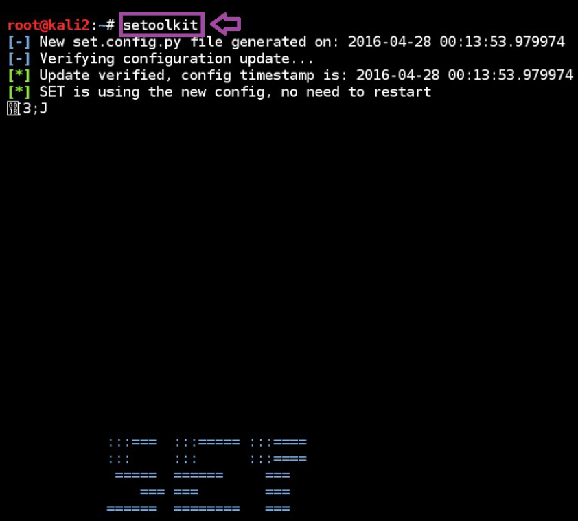
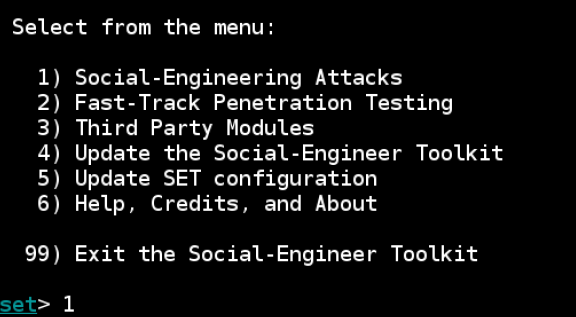
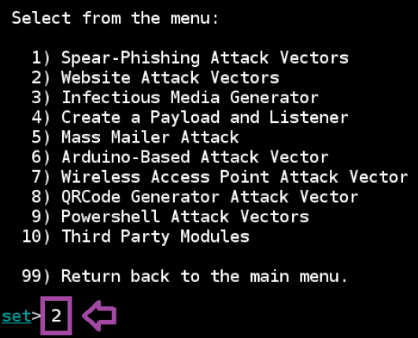
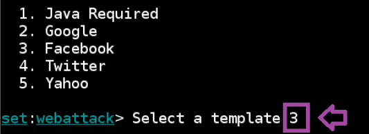
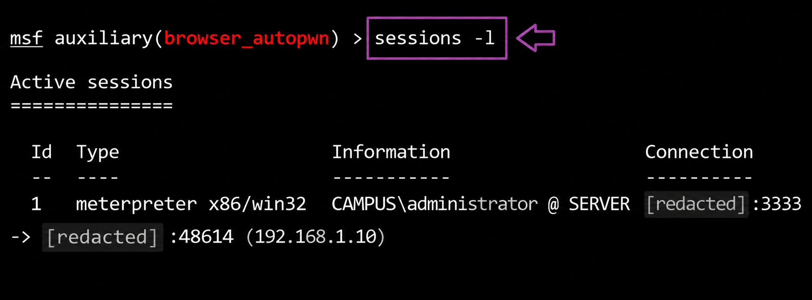
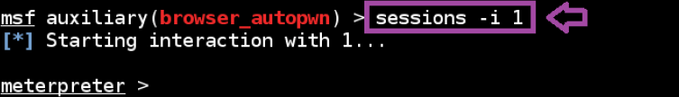

# Phishing Attack Simulation and Security Awareness Lab

---

## Overview

This repository documents a controlled phishing attack simulation and post-compromise investigation workflow performed in a private lab environment.

The objective of the lab was to understand phishing attack chains, session establishment, social engineering techniques, and defensive security considerations related to phishing-based compromise scenarios.

---

## MITRE ATT&CK Mapping

| Technique | ID | Tactic |
|---|---|---|
| Phishing | T1566 | Initial Access |
| Drive-by Compromise | T1189 | Initial Access |
| Valid Accounts | T1078 | Defense Evasion |
| Command and Scripting Interpreter | T1059 | Execution |

---

## Lab Objectives

- Simulate phishing-based attack delivery
- Understand social engineering attack workflows
- Analyze Meterpreter session establishment
- Review post-compromise access behavior
- Study attacker tradecraft in controlled environments
- Explore defensive detection opportunities

---

## Tools Used

| Tool | Purpose |
|---|---|
| SEToolkit | Social engineering attack simulation |
| Metasploit Framework | Session handling and payload interaction |
| Kali Linux | Offensive security testing environment |

---

## Investigation Workflow

### 1. Launching SEToolkit

The Social-Engineer Toolkit (SET) was launched to simulate phishing-based attack workflows.

---

### 2. Social Engineering Attack Menu

Social engineering attack vectors were reviewed and configured.

---

### 3. Website Attack Vector Selection

A website attack vector was selected to simulate phishing delivery methods.

---

### 4. Social Media Phishing Template Selection

A phishing template was selected inside the controlled lab workflow.

---

### 5. Meterpreter Session Establishment

Successful Meterpreter session establishment was validated during the simulation.

---

### 6. Meterpreter Session Interaction

Session interaction and controlled post-compromise access were reviewed.

---

## Detection Opportunities

Security teams can monitor for:

- Suspicious phishing infrastructure activity
- Browser exploitation attempts
- Unexpected Meterpreter traffic patterns
- Reverse shell communication
- Abnormal outbound connections
- Social engineering attack indicators

---

## Security Recommendations

- Implement phishing awareness training
- Restrict script execution policies
- Monitor outbound command-and-control traffic
- Deploy EDR monitoring solutions
- Enable centralized logging and SIEM correlation
- Use network segmentation and application controls

---

## Skills Demonstrated

- Social engineering workflow analysis
- Controlled phishing simulation
- Meterpreter session handling
- Attack chain understanding
- Defensive security awareness
- Security documentation
- MITRE ATT&CK mapping
- Investigation reporting

---

## Ethical Notice

This repository documents security research and controlled lab experimentation performed in isolated environments for educational and defensive security purposes only.
